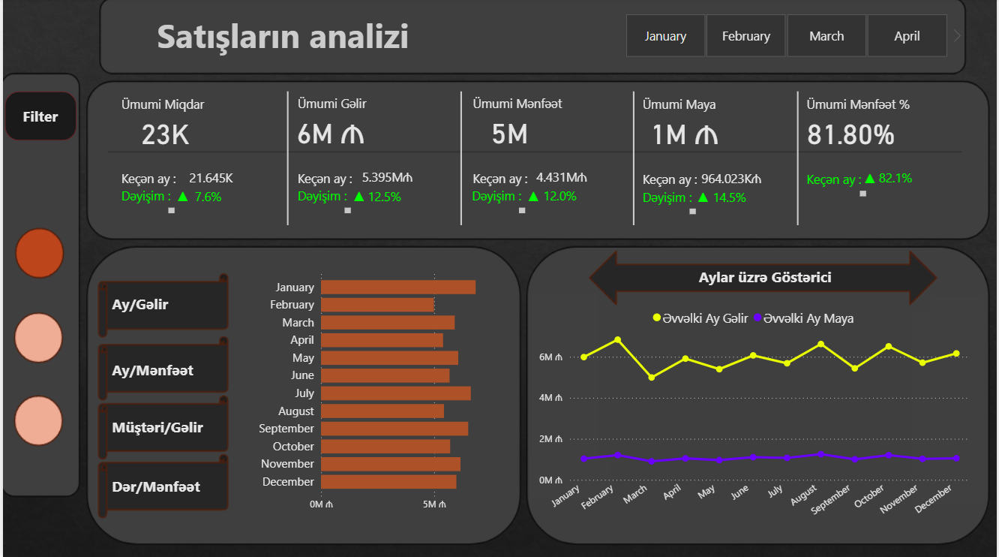
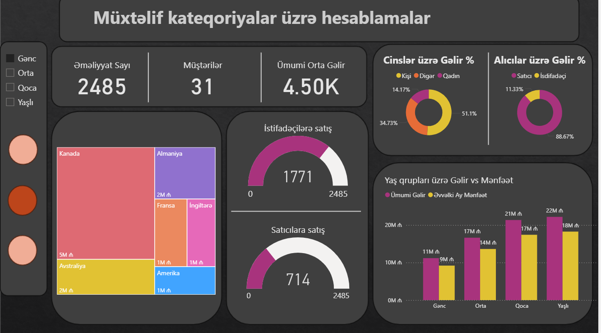

# Drugstore Sales Analytics Dashboard

This project presents an *interactive Drugstore Sales Dashboard* developed in *Power BI* using Excel datasets (Satışlar.xlsx, Müştərilər.xlsx, Dərmanlar.xlsx).  
The aim is to turn raw drugstore sales and customer data into *actionable insights* that help pharmacies and healthcare businesses optimize their performance.  

---

## 📊 Analysis
- Overall Sales, Revenue, Profit, and Cost  
- Monthly performance and growth compared to previous months  
- Customer insights: Age groups, Gender-based income, Buyers vs Users  
- Product-level analysis of medicines and categories  
- Regional sales distribution and country-wise contributions  
- Profitability by segment  

---

## 🔑 Key Concepts Used
- Excel-based data preparation (Sales, Customers, Drugs datasets)  
- Power BI Visualizations & KPIs  
- Key metrics: Total Sales, Total Profit, Profit %, Customer Count  
- Charts: Line, Bar, Pie, TreeMap, Donut  
- Drill-down, filters, and interactive slicers  

---

## 🖼 Outputs (Dashboard Screenshots)

### 1. Sales Overview

### 2. Customer & Category Insights

---

## 📝 Notes
- The dataset is sample data prepared for a *drugstore sales system*.  
- Dashboards are built entirely in *Power BI*.  
- The project demonstrates how analytics can improve efficiency in pharmacies and retail businesses.  

---

##  About Me

---
